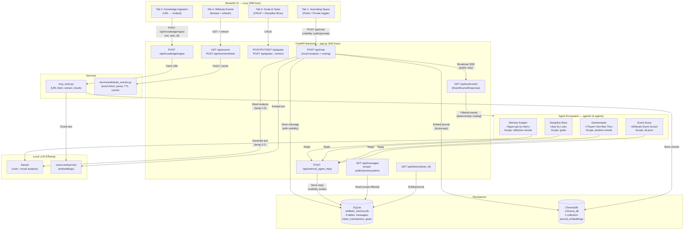

# WildTails -- Catalyst Verse

> A privacy-first, multi-agent journaling platform powered by local LLMs, mood-based planet routing, and real-time agent collaboration via SSE.

**WildTails** is a graduation capstone project that builds a complete multi-agent ecosystem around an emotion-aware journal. Users write journal entries through a Streamlit UI, the system analyzes their mood via a local Ollama LLM (llama3), routes them to a thematic "planet," and dispatches one or more specialized AI persona agents to respond in real time -- all while enforcing strict privacy isolation between public and private entries.

The backend is a FastAPI server exposing 13 REST/SSE endpoints. It persists data across three SQLite tables and a ChromaDB vector store. Four concurrent persona agents subscribe to the SSE event stream with deterministic routing filters so that each agent only activates on events within its scope, preventing agent spam.

---

## Architecture



### Data Flow (Step by Step)

1. User writes a journal entry in the Streamlit **Journaling Space** tab, choosing **Planet Feed** (public) or **Captain's Cabin** (private).
2. `POST /api/chat` sends the entry to FastAPI with `visibility: "public"` or `"private"`.
3. The backend calls Ollama **llama3** (temperature 0.3) with a Vietnamese-language mood analysis system prompt. The LLM returns `{"mood", "planet", "action"}`.
4. The entry + system reply are stored in **SQLite** `messages` table with the chosen `visibility`. The entry is also embedded into **ChromaDB** via Ollama **nomic-embed-text** (wrapped in try/except -- the API never crashes if the embedding model is missing).
5. If `visibility == "public"`, an SSE event (`NEW_USER_JOINED`) is broadcast to all subscribers. Private entries **never** trigger SSE.
6. Each of the 4 agents' **`event_filter()`** method checks whether the event matches its scope. Only matching agents proceed.
7. A matching agent fetches recent public context from `GET /api/messages`, generates an LLM-powered reply (temperature 0.7), and posts it back via `POST /api/external_agent_reply`.
8. The Streamlit UI fetches updated messages on the next refresh and renders each agent's reply with its unique emoji/label.

---

## Prerequisites

| Dependency | Version | Purpose |
|-----------|---------|---------|
| **Python** | 3.11+ | Runtime (tested on 3.14) |
| **[Ollama](https://ollama.com)** | Latest | Local LLM inference server |
| **llama3** | Pulled via Ollama | Chat completions and mood analysis |
| **nomic-embed-text** | Pulled via Ollama | Text embedding for ChromaDB |

### Install Ollama Models

```bash
ollama pull llama3
ollama pull nomic-embed-text
```

Verify Ollama is running at `http://localhost:11434` before starting the backend.

---

## Quick Start

### 1. Clone and Install Dependencies

```bash
cd agent-planet-system

python -m venv venv

# Windows:
venv\Scripts\activate
# macOS / Linux:
source venv/bin/activate

pip install -r requirements.txt
```

`requirements.txt` contains 14 packages:

| Package | Purpose |
|---------|---------|
| `fastapi` | Backend REST API framework |
| `uvicorn` | ASGI server |
| `pydantic` | Request/response data validation |
| `sse-starlette` | Server-Sent Events support |
| `openai` | OpenAI-compatible client for Ollama |
| `streamlit` | Frontend web UI |
| `requests` | HTTP client (agents + services) |
| `chromadb` | Persistent vector store for embeddings |
| `python-dotenv` | `.env` file loading |
| `beautifulsoup4` | HTML parsing for knowledge ingestion |
| `youtube-transcript-api` | YouTube transcript extraction |
| `pytest` | Test runner |
| `pytest-asyncio` | Async test support |
| `httpx` | Async HTTP client for FastAPI test fixtures |

### 2. Environment Configuration

```bash
cp .env.example .env
# Edit .env only if your Ollama runs on a non-default host/port
```

`.env.example` contents:

```env
OLLAMA_BASE_URL=http://localhost:11434/v1
OLLAMA_CHAT_MODEL=llama3
OLLAMA_EMBED_MODEL=nomic-embed-text
```

| Variable | Default | Used By |
|----------|---------|---------|
| `OLLAMA_BASE_URL` | `http://localhost:11434/v1` | `app.py` (async client), `agents/base_agent.py` (sync client) |
| `OLLAMA_CHAT_MODEL` | `llama3` | Mood analysis (`app.py`), agent reply generation (`agents/`) |
| `OLLAMA_EMBED_MODEL` | `nomic-embed-text` | `embed_text()` in `app.py` for journal + knowledge embeddings |

The agents also read `BACKEND_URL` (default `http://127.0.0.1:8000`) from the environment.

### 3. Start the System (3 Terminals)

**Terminal 1 -- FastAPI Backend:**

```bash
python app.py
# Starts uvicorn at http://127.0.0.1:8000
# Initializes SQLite (wildtails_memory.db) and ChromaDB (./chroma_db/) on startup
```

**Terminal 2 -- Streamlit Frontend:**

```bash
streamlit run ui.py
# Opens browser at http://localhost:8501
# Connects to backend at http://127.0.0.1:8000
```

**Terminal 3 -- Agent Ecosystem (all 4 agents concurrently):**

```bash
python -m agents.run_all
# Launches Memory Keeper, Discipline Boss, Gamemaster, Event Scout
# Each agent connects to GET /api/sse/events in its own daemon thread
# Ctrl+C for graceful shutdown (SIGINT handler)
```

### 4. Run Tests

```bash
python -m pytest tests/ -v
```

Expected output: **35 passed** (privacy: 5, tokens: 4, mood router: 6, events: 20).

Tests use temporary SQLite databases (`tmp_path` fixture), mock the Ollama LLM, and read from the local HTML fixture -- no running backend or Ollama instance required.

---

## Privacy Model

WildTails enforces strict privacy isolation at every layer:

### Visibility Levels

| Mode | UI Toggle | `visibility` Value | SSE Broadcast | Agents See It | Default API Scope |
|------|-----------|-------------------|---------------|---------------|-------------------|
| **Planet Feed** | "Planet Feed (Public)" | `public` | Yes | Yes | Yes |
| **Captain's Cabin** | "Captain's Cabin (Private)" | `private` | **No** | **No** | **No** |

### API Scope Filtering (`GET /api/messages?scope=...`)

| Scope | Returns | Use Case |
|-------|---------|----------|
| `public` (default) | Only `visibility=public` messages | External agents, other users |
| `owner:Mina` | All public messages + Mina's private messages | Streamlit UI for the logged-in user |
| `system` | All messages regardless of visibility | Admin/internal debugging |

### Guarantees

- A **private** journal entry is stored in SQLite with `visibility=private` and in ChromaDB with `visibility: "private"` metadata.
- Private entries **never** trigger an SSE event (`NEW_USER_JOINED` or otherwise).
- Private entries **never** appear in the default `GET /api/messages` response.
- Private entries **never** appear in another user's `owner:` scope.
- Agent replies posted via `POST /api/external_agent_reply` default to `visibility=public`.

These guarantees are enforced by 5 dedicated pytest tests in `tests/test_privacy.py`.

---

## API Reference (13 Endpoints)

### Core Chat

| Method | Endpoint | Request Body | Response | Notes |
|--------|----------|-------------|----------|-------|
| GET | `/` | -- | `{"message": "..."}` | Health check |
| POST | `/api/chat` | `{user_id, user_name, message, visibility?}` | `{user_name, mood, assigned_planet, agent_reply, visibility}` | Mood analysis + planet routing. Stores in SQLite + ChromaDB. Broadcasts SSE if public. |
| GET | `/api/messages` | Query: `scope` | `{messages: [{role, sender, content, visibility}]}` | Scope-filtered history (see Privacy Model) |
| GET | `/api/sse/events` | -- | SSE stream (`event: agent_message`) | Long-lived connection for agents |
| POST | `/api/external_agent_reply` | `{agent_name, message}` | `{status: "success"}` | Agents post replies to chat timeline |

### Knowledge Ingestion

| Method | Endpoint | Request Body | Response |
|--------|----------|-------------|----------|
| POST | `/api/knowledge/ingest` | `{url, user_id, user_name?}` | `{status, title, source_type, total_chunks, stored_chunks}` |

Supported sources: web articles (BeautifulSoup extraction), YouTube videos (transcript API with Vietnamese/English preference, falls back to page scrape). Safety limits: 15s timeout, 2MB max download, 50K char text cap. Chunks: 500 words with 50-word overlap.

### Goals

| Method | Endpoint | Request Body | Response |
|--------|----------|-------------|----------|
| POST | `/api/goals` | `{user_id, user_name, title}` | `{status, goal_id}` |
| PUT | `/api/goals/{goal_id}` | `{status: "completed" or "abandoned"}` | `{status}` |
| GET | `/api/goals/{user_id}` | -- | `{goals: [{id, title, status, created_at, updated_at}]}` |
| POST | `/api/goals/{user_id}/remind` | -- | `{status, pending_count}` |

Goal creation and updates broadcast `GOAL_UPDATE` SSE events. The remind endpoint broadcasts `GOAL_REMINDER` with all pending goal titles. Both event types are consumed exclusively by the Discipline Boss agent.

### Gamification

| Method | Endpoint | Response |
|--------|----------|----------|
| GET | `/api/tokens/{user_id}` | `{user_id, balance}` |

Returns `COALESCE(SUM(amount), 0)` from `token_transactions`. Returns `0` for users with no transactions.

### Wildcats Events

| Method | Endpoint | Response |
|--------|----------|----------|
| GET | `/api/events` | `{events: [{title, description, event_date, location, event_url, tags}]}` |
| POST | `/api/events/refresh` | `{status: "refreshed", count}` |

Events are fetched from `https://www.wildcats.io/event-list`, parsed with BeautifulSoup, and cached in memory with a 10-minute TTL. If the live fetch fails, the API falls back to a local HTML fixture.

---

## Agent Routing Matrix

Each agent extends `BaseAgent` (defined in `agents/base_agent.py`) and implements an `event_filter(data) -> bool` method. This is the deterministic routing gate -- an agent's `handle_event()` is only called when `event_filter()` returns `True`.

| Agent | Vietnamese Name | `event_filter()` Accepts | `event_filter()` Rejects |
|-------|----------------|------------------------|------------------------|
| **Memory Keeper** | Nguoi giu ky niem | `NEW_USER_JOINED` where `planet == "Vuon ky niem"` | Sun planet joins, goals, games |
| **Discipline Boss** | Sep Ky Luat | `GOAL_UPDATE`, `GOAL_REMINDER` | All user joins, games, events |
| **Gamemaster** | Thuyen Vien Bao Thu | `NEW_USER_JOINED` where `planet == "Hanh tinh mat troi"`, `GAME_REQUEST` | Garden planet joins, goals |
| **Event Scout** | Wildcats Event Scout | `NEW_USER_JOINED` (any planet), `EVENT_MATCH_REQUEST` | Goals, games |

### SSE Event Types

| Event Type | Triggered By | Consumed By |
|-----------|-------------|-------------|
| `NEW_USER_JOINED` | `POST /api/chat` (public only) | Memory Keeper (garden), Gamemaster (sun), Event Scout (both) |
| `GOAL_UPDATE` | `POST /api/goals`, `PUT /api/goals/{id}` | Discipline Boss |
| `GOAL_REMINDER` | `POST /api/goals/{user_id}/remind` | Discipline Boss |
| `GAME_REQUEST` | (Future: UI game button) | Gamemaster |
| `EVENT_MATCH_REQUEST` | (Future: UI event search) | Event Scout |

No single event type activates all 4 agents simultaneously (verified by anti-spam tests).

---

## Database Schema

### SQLite Tables (`wildtails_memory.db`)

**messages**

| Column | Type | Constraints |
|--------|------|------------|
| `id` | INTEGER | PRIMARY KEY AUTOINCREMENT |
| `sender_name` | TEXT | NOT NULL |
| `role` | TEXT | NOT NULL, CHECK IN ('user', 'assistant') |
| `content` | TEXT | NOT NULL |
| `visibility` | TEXT | NOT NULL DEFAULT 'public', CHECK IN ('private', 'public') |
| `timestamp` | DATETIME | DEFAULT CURRENT_TIMESTAMP |

**token_transactions**

| Column | Type | Constraints |
|--------|------|------------|
| `id` | INTEGER | PRIMARY KEY AUTOINCREMENT |
| `user_id` | TEXT | NOT NULL |
| `amount` | INTEGER | NOT NULL (positive = earned, negative = spent) |
| `reason` | TEXT | NOT NULL |
| `reference_type` | TEXT | nullable |
| `created_at` | DATETIME | DEFAULT CURRENT_TIMESTAMP |

**goals**

| Column | Type | Constraints |
|--------|------|------------|
| `id` | INTEGER | PRIMARY KEY AUTOINCREMENT |
| `user_id` | TEXT | NOT NULL |
| `user_name` | TEXT | NOT NULL |
| `title` | TEXT | NOT NULL |
| `status` | TEXT | NOT NULL DEFAULT 'in_progress', CHECK IN ('in_progress', 'completed', 'abandoned') |
| `created_at` | DATETIME | DEFAULT CURRENT_TIMESTAMP |
| `updated_at` | DATETIME | DEFAULT CURRENT_TIMESTAMP |

A safe `ALTER TABLE` migration (`app.py:60-64`) adds the `visibility` column to pre-existing `messages` tables without data loss.

### ChromaDB Collection (`./chroma_db`)

**journal_embeddings** -- stores vector embeddings for:
- Journal entries (from `POST /api/chat`) with metadata: `user_id`, `user_name`, `mood`, `planet`, `visibility`
- Knowledge chunks (from `POST /api/knowledge/ingest`) with metadata: `user_id`, `user_name`, `source_url`, `source_type`, `title`, `chunk_index`, `total_chunks`, `visibility`

---

## Streamlit UI Layout (`ui.py`)

### Sidebar

- **User avatar** (DiceBear Notionists API) and display name
- **Catalyst Points** balance badge (gradient-styled, fetched from `GET /api/tokens/{user_id}`)
- **Current mood** and **assigned planet** with color-coded indicators:
  - Sun Planet: orange/gold gradient
  - Memory Garden: green gradient
- **Refresh Messages** button

### Tab 1: Journaling Space

- **Visibility radio toggle**: "Planet Feed (Public)" vs "Captain's Cabin (Private)"
- Contextual info banner changes based on selected mode
- **Chat history** fetched with `scope=owner:{USER_NAME}` (sees own private entries)
- **Per-agent visual differentiation** using emoji + label:
  - System Agent: satellite emoji
  - Memory Keeper: cherry blossom emoji
  - Discipline Boss: megaphone emoji
  - Gamemaster: game controller emoji
  - Event Scout: telescope emoji
- Private messages prefixed with lock emoji
- **Chat input** sends `visibility` field with the request

### Tab 2: Knowledge Ingestion

- URL text input with form submission
- Calls `POST /api/knowledge/ingest`
- Displays spinner during processing, success card with title/source type/chunk counts on completion

### Tab 3: Goals and Tasks

- **Add goal** form (calls `POST /api/goals`)
- **Goal list** with status-styled rendering (blue = active, green = done, strikethrough = abandoned)
- **Complete** button per goal (calls `PUT /api/goals/{id}`)
- **"Summon Discipline Boss"** button (calls `POST /api/goals/{user_id}/remind`)

### Tab 4: Wildcats Events

- **Refresh** button (calls `POST /api/events/refresh`)
- Event cards with linked title, description preview, date, location, and tag badges

### Theming

Custom CSS applies a cosmic dark gradient to the sidebar (`#0d1117` to `#161b22`), gradient token badge, and color-coded planet indicators. No external CSS frameworks required.

---

## Test Suite (35 Tests)

All tests run offline -- no Ollama, no backend, no internet required.

| File | Tests | Coverage |
|------|-------|----------|
| `tests/test_privacy.py` | 5 | Private message not in public scope; visible to owner; not visible to other owner; system scope sees all; public message visible everywhere |
| `tests/test_tokens.py` | 4 | Zero balance for new user; positive balance sum; mixed (positive + negative) net; user isolation |
| `tests/test_mood_router.py` | 6 | Valid positive mood; valid sad mood; invalid JSON fallback; wrong planet value fallback; empty mood fallback; LLM exception fallback |
| `tests/test_events.py` | 20 | Fixture parses 5 events; titles; dates; locations; tags; absolute URLs; descriptions; serialization; search AI/gaming/wellness; no results; top_k limit; fresh/loaded/stale cache; auto-refresh; empty HTML; no events HTML; malformed HTML |

Testing strategy:
- **Database isolation**: Each test uses a temporary SQLite DB via `tmp_path` pytest fixture
- **LLM mocking**: `unittest.mock.patch` replaces `ollama_client.chat.completions.create` and `embed_text` with `AsyncMock`
- **API testing**: `httpx.AsyncClient` with `ASGITransport` drives the FastAPI app in-process (no network)
- **Event parsing**: Uses the local HTML fixture at `tests/fixtures/wildcats_events.html` (5 sample events)

Run: `python -m pytest tests/ -v`

---

## Project Structure

```
agent-planet-system/
|
|-- app.py                          # FastAPI backend: 13 endpoints, 540 lines
|-- ui.py                           # Streamlit UI: 4 tabs, sidebar, cosmic theme, 399 lines
|-- mcp_tools.py                    # URL fetch + extract + chunk (article + YouTube), 159 lines
|-- prompts.py                      # System prompt templates (System Agent, Sub-Agent), 24 lines
|-- other_agents_client.py          # Legacy standalone agent (superseded by agents/), 123 lines
|-- requirements.txt                # 14 Python dependencies
|-- .env.example                    # Environment variable template (3 variables)
|-- .gitignore                      # Shields *.db, chroma_db/, venv/, .env, __pycache__/, .pytest_cache/
|-- README.md                       # This file
|-- IMPLEMENTATION STATUS.md        # MVP feature checklist (all phases checked off)
|
|-- agents/                         # Multi-persona agent framework
|   |-- __init__.py
|   |-- base_agent.py               # Abstract base: SSE listener, LLM generation, reply dispatch, 154 lines
|   |-- memory_keeper.py            # Reflective mood agent (Vuon ky niem scope), 42 lines
|   |-- discipline_boss.py          # Goal tracking agent (GOAL_UPDATE/REMINDER scope), 75 lines
|   |-- gamemaster.py               # Trivia + RPG agent (Hanh tinh mat troi scope), 130 lines
|   |-- event_matcher.py            # Wildcats event recommendation agent, 104 lines
|   |-- run_all.py                  # Concurrent launcher (4 daemon threads + SIGINT handler), 58 lines
|
|-- services/                       # Business logic services
|   |-- __init__.py
|   |-- wildcats_events.py          # Event fetcher, HTML parser, TTL cache, keyword search, 217 lines
|
|-- tests/                          # Pytest test suite: 35 tests
    |-- __init__.py
    |-- test_privacy.py             # 5 tests: database isolation and privacy scoping
    |-- test_tokens.py              # 4 tests: token ledger balance aggregation
    |-- test_mood_router.py         # 6 tests: mood analysis valid/invalid/fallback
    |-- test_events.py              # 20 tests: event parsing, search, cache, edge cases
    |-- fixtures/
        |-- wildcats_events.html    # 5-event local HTML fixture for offline testing
```

**Total**: 16 Python source files, 2,490 lines of code, 35 automated tests.

---

## Summary Metrics

| Metric | Value |
|--------|-------|
| API endpoints | 13 (excluding startup lifecycle) |
| SQLite tables | 3 (messages, token_transactions, goals) |
| ChromaDB collections | 1 (journal_embeddings) |
| Persona agents | 4 (Memory Keeper, Discipline Boss, Gamemaster, Event Scout) |
| SSE event types | 5 (NEW_USER_JOINED, GOAL_UPDATE, GOAL_REMINDER, GAME_REQUEST, EVENT_MATCH_REQUEST) |
| Streamlit UI tabs | 4 (Journal, Knowledge, Goals, Events) |
| Automated tests | 35 (privacy: 5, tokens: 4, mood: 6, events: 20) |
| Python source files | 16 |
| Total lines of code | 2,490 |
| Dependencies | 14 |

---

## License

This project is developed as part of a graduation capstone. All rights reserved.
