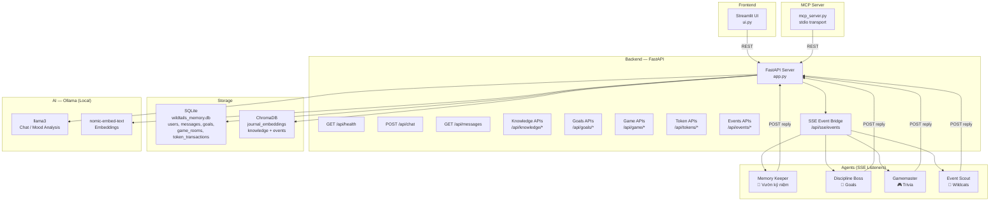

# WildTails — Catalyst Verse

A multi-agent journaling platform where AI personas respond to user mood, gamify personal growth, and connect users with community events. Built with FastAPI, Streamlit, ChromaDB, and local LLMs via Ollama.

## Architecture



## Quick Start

```bash
# 1. Install dependencies
pip install -r requirements.txt

# 2. Start Ollama with required models
ollama pull llama3
ollama pull nomic-embed-text

# 3. Configure environment
cp .env.example .env

# 4. Start the backend
python app.py

# 5. Start the agents (in a separate terminal)
python -m agents.run_all

# 6. Start the UI (in a separate terminal)
streamlit run ui.py

# 7. (Optional) Start the MCP server
python mcp_server.py
```

## Running Tests

```bash
python -m pytest tests/ -v
```

## Project Structure

```
agent-planet-system/
├── app.py                    # FastAPI backend (all APIs)
├── ui.py                     # Streamlit frontend (7 tabs)
├── mcp_server.py             # MCP server (3 tools)
├── mcp_tools.py              # URL fetching, SSRF validation, chunking
├── prompts.py                # System prompts
├── requirements.txt          # Dependencies
├── .env.example              # Environment template
│
├── agents/
│   ├── base_agent.py         # Abstract agent framework
│   ├── memory_keeper.py      # Reflective mood agent
│   ├── discipline_boss.py    # Goal tracking agent
│   ├── gamemaster.py         # Trivia game agent
│   ├── event_matcher.py      # Semantic event matching agent
│   └── run_all.py            # Concurrent agent launcher
│
├── services/
│   ├── event_bridge.py       # Bounded-queue SSE bridge
│   ├── token_service.py      # Idempotent token awarding
│   ├── vector_memory.py      # Privacy-aware ChromaDB search
│   └── wildcats_events.py    # Event fetcher + cache
│
└── tests/
    ├── test_events.py              # 20 event parser tests
    ├── test_mood_router.py         # 6 mood analysis tests
    ├── test_privacy.py             # 8 privacy isolation tests
    ├── test_tokens.py              # 10 token + idempotency tests
    ├── test_vector_memory.py       # 6 vector retrieval tests
    ├── test_knowledge_rag.py       # 15 RAG + URL validation tests
    ├── test_mcp_server.py          # 8 MCP tool handler tests
    ├── test_game_loop.py           # 8 game state machine tests
    ├── test_goals_expanded.py      # 5 expanded goals tests
    ├── test_event_bridge.py        # 6 event bridge tests
    ├── test_integration_privacy.py # 5 end-to-end privacy proofs
    └── fixtures/
        └── wildcats_events.html    # Test fixture (5 events)
```

## Key Features

- **Privacy-first**: Private entries never leak to SSE, public agents, or other users
- **Multi-agent ecosystem**: 4 persona agents with deterministic routing
- **Semantic search**: ChromaDB-powered vector retrieval with privacy enforcement
- **Gamification**: Trivia game loop with idempotent token rewards
- **Local RAG**: URL ingestion + semantic search + LLM-powered Q&A
- **MCP integration**: 3 tools via official MCP SDK
- **SSRF protection**: URL validation blocking private IPs and non-http schemes
