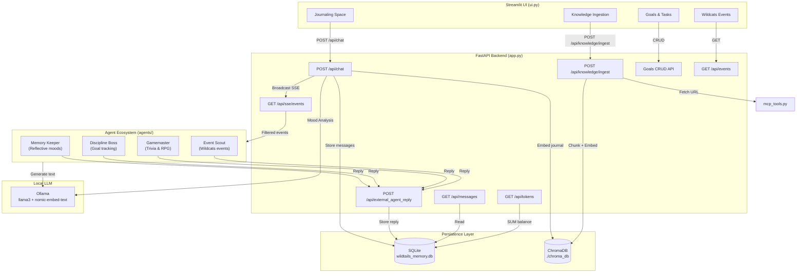

# WildTails — Catalyst Verse

> A multi-agent journaling platform powered by local LLMs, mood-based routing, and a privacy-first architecture.

**WildTails** is a graduation capstone project that demonstrates a complete multi-agent ecosystem where AI personas interact with users through an emotion-aware journal system. Users write journal entries, the system analyzes their mood using a local Ollama LLM, routes them to a thematic "planet," and dispatches specialized AI agents to respond — all while enforcing strict privacy isolation between public and private entries.

---

## Architecture



### Data Flow

1. User writes a journal entry in the Streamlit UI
2. `POST /api/chat` sends it to the backend, which calls Ollama for mood analysis
3. The entry is stored in SQLite (with visibility flag) and embedded in ChromaDB
4. If the entry is **public**, an SSE event is broadcast to all connected agents
5. Each agent's **event filter** determines if it should respond (deterministic routing)
6. Matching agents generate an LLM-powered reply and post it back to the chat timeline
7. The UI fetches updated messages on refresh

---

## Prerequisites

| Dependency | Version | Purpose |
|-----------|---------|---------|
| Python | 3.11+ | Runtime |
| [Ollama](https://ollama.com) | Latest | Local LLM server |
| llama3 model | Via Ollama | Chat & mood analysis |
| nomic-embed-text | Via Ollama | Text embeddings |

### Install Ollama Models

```bash
ollama pull llama3
ollama pull nomic-embed-text
```

---

## Quick Start

### 1. Clone & Install

```bash
cd agent-planet-system
python -m venv venv
# Windows:
venv\Scripts\activate
# macOS/Linux:
source venv/bin/activate

pip install -r requirements.txt
```

### 2. Environment Configuration

```bash
cp .env.example .env
# Edit .env if your Ollama is on a different host/port
```

Default values in `.env.example`:

| Variable | Default | Description |
|----------|---------|-------------|
| `OLLAMA_BASE_URL` | `http://localhost:11434/v1` | Ollama API endpoint |
| `OLLAMA_CHAT_MODEL` | `llama3` | Model for mood analysis & chat |
| `OLLAMA_EMBED_MODEL` | `nomic-embed-text` | Model for text embeddings |

### 3. Start the System (3 Terminals)

**Terminal 1 — Backend API:**
```bash
python app.py
# FastAPI server at http://127.0.0.1:8000
```

**Terminal 2 — Streamlit UI:**
```bash
streamlit run ui.py
# Web UI at http://localhost:8501
```

**Terminal 3 — Agent Ecosystem:**
```bash
python -m agents.run_all
# Launches all 4 persona agents concurrently
```

### 4. Run Tests

```bash
pip install pytest pytest-asyncio httpx
python -m pytest tests/ -v
```

---

## Privacy Model

WildTails enforces a strict privacy boundary between public and private journal entries:

| Concept | Behavior |
|---------|----------|
| **Captain's Cabin** (Private) | Entry stored with `visibility=private`. NO SSE broadcast. External agents never see it. Not returned by default `GET /api/messages`. |
| **Planet Feed** (Public) | Entry stored with `visibility=public`. SSE event broadcast to agent ecosystem. Visible to all agents and users. |
| **Owner Scope** | `GET /api/messages?scope=owner:Mina` returns public messages + Mina's private messages only. |
| **System Scope** | `GET /api/messages?scope=system` returns all messages (admin/internal use). |
| **ChromaDB** | Embeddings include `visibility` metadata. Agents can filter by visibility when querying. |

**Guarantee:** A private entry can never trigger an SSE event, never appear in another user's feed, and never be served to external agents via the public messages API.

---

## API Reference

| Endpoint | Method | Description |
|----------|--------|-------------|
| `/` | GET | Health check |
| `/api/chat` | POST | Submit journal entry (mood analysis + routing) |
| `/api/messages` | GET | Retrieve message history (scope-filtered) |
| `/api/sse/events` | GET | SSE stream for agent subscriptions |
| `/api/external_agent_reply` | POST | Agents post replies to chat timeline |
| `/api/knowledge/ingest` | POST | Extract & embed content from a URL |
| `/api/goals` | POST | Create a new goal |
| `/api/goals/{goal_id}` | PUT | Update goal status |
| `/api/goals/{user_id}` | GET | List user goals |
| `/api/goals/{user_id}/remind` | POST | Trigger Discipline Boss reminder |
| `/api/tokens/{user_id}` | GET | Get Catalyst Points balance |
| `/api/events` | GET | List cached Wildcats events |
| `/api/events/refresh` | POST | Force-refresh events from wildcats.io |

---

## Agent Routing Matrix

Each agent subscribes to specific SSE event types via a deterministic `event_filter()`. This prevents agent spam.

| Agent | Listens For | Ignores |
|-------|------------|---------|
| Memory Keeper | `NEW_USER_JOINED` + planet="Vườn kỷ niệm" | Sun planet, goals, games |
| Discipline Boss | `GOAL_UPDATE`, `GOAL_REMINDER` | All user joins, games |
| Gamemaster | `NEW_USER_JOINED` + planet="Hành tinh mặt trời", `GAME_REQUEST` | Garden planet, goals |
| Event Scout | `NEW_USER_JOINED` (any), `EVENT_MATCH_REQUEST` | Goals, games |

---

## Project Structure

```
agent-planet-system/
├── app.py                          # FastAPI backend (14 endpoints)
├── ui.py                           # Streamlit product UI
├── mcp_tools.py                    # URL fetching, text extraction, chunking
├── prompts.py                      # System prompt templates
├── other_agents_client.py          # Legacy standalone agent (superseded)
├── requirements.txt                # Python dependencies
├── .env.example                    # Environment variable template
├── .gitignore                      # Shields DB, chroma, venv, .env
│
├── agents/                         # Multi-persona agent framework
│   ├── base_agent.py               # Abstract base class (SSE + LLM)
│   ├── memory_keeper.py            # Reflective mood agent
│   ├── discipline_boss.py          # Goal tracking agent
│   ├── gamemaster.py               # Trivia & RPG agent
│   ├── event_matcher.py            # Wildcats event recommendation agent
│   └── run_all.py                  # Concurrent launcher
│
├── services/                       # Business logic services
│   └── wildcats_events.py          # Event fetcher, parser, TTL cache
│
└── tests/                          # Pytest test suite
    ├── test_privacy.py             # Privacy isolation tests (5 tests)
    ├── test_tokens.py              # Token ledger tests (4 tests)
    ├── test_mood_router.py         # Mood analysis & fallback tests (6 tests)
    ├── test_events.py              # Event parser & cache tests (20 tests)
    └── fixtures/
        └── wildcats_events.html    # Local HTML fixture for offline tests
```

---

## License

This project is developed as part of a graduation capstone. All rights reserved.
